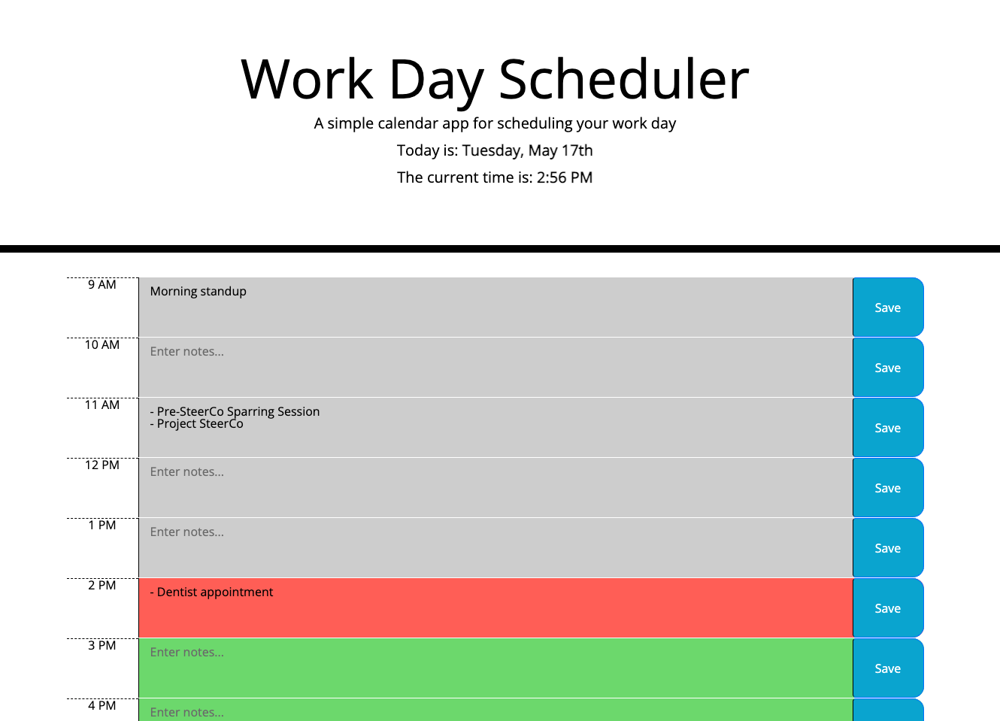
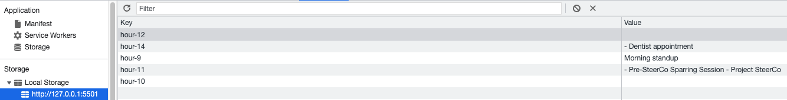

# Day Planner

## **Description**

A simple calendar application to plan out your daily tasks.

This application utilizes local storage and several third-party APIs including: Bootstrap, Moment.js, JQuery, and Google Fonts.

## **Links**
- Deployed [site link](https://colinbrindle.github.io/day-planner/)
- [GitHub repository](https://github.com/colinbrindle/day-planner)

## **Site Screenshots**

